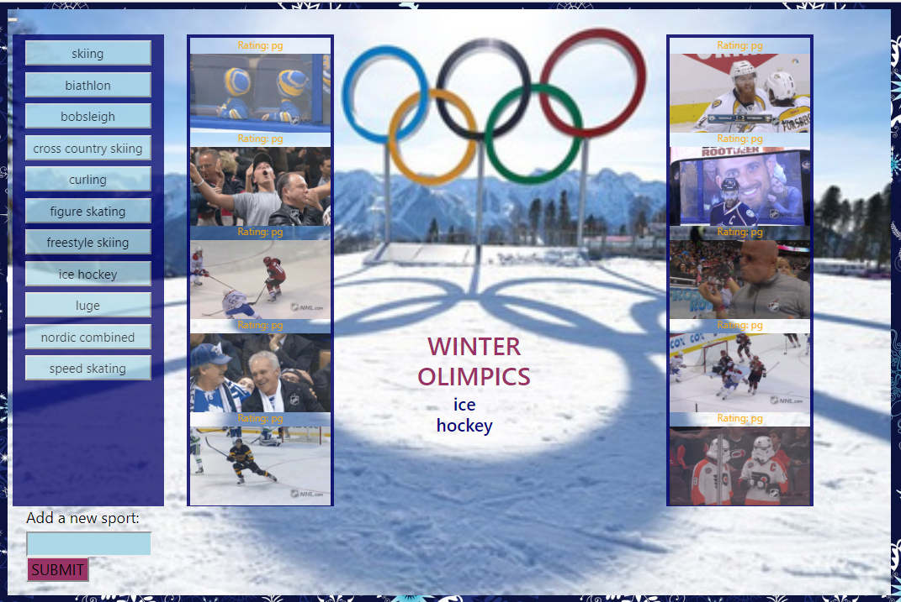

# WinterOlimpicsGifs

This program uses GIPHY API to make a dynamic web page that populates with gifs chosen by the user. The GIPHY API is called and JavaScript and jQuery are used to change the HTML of the site.

**Accessing the Service**

You can find the service on
[GitHub](https://edudek002.github.io/WinterOlimpicsGifs//)

**User Flow**

1. On the main page you will see the list of winter sports events.

 2. After you pick on the event, the list of 10 gifs will display. You can click on the picture to see the dinamic gif.

 You also have an opportunity to enter any other theme you choose in a box on the lower-left side.

 

